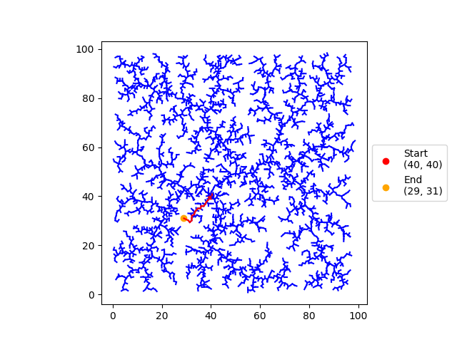
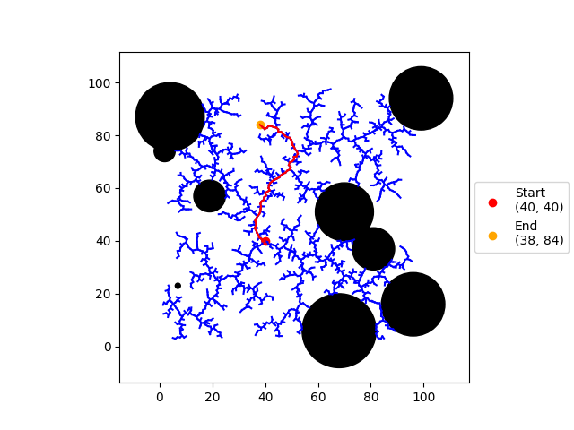

# Rapidly Exploring Random Tree (RRT)
Author: Katie Hughes

This repo implements a RRT in 2 and 3 dimensional space.

## 2D algorithm
To run:

`python3 RRT_2D.py -t [task number]`

Tasks:
1. RRT with no obstacles

2. RRT with randomly generated circular obstacles

3. RRT with a more complex obstacle (N_map.png)

Additionally, you can pass the `-v` flag to print out more information about what is happening during each iteration of the algorithm.

## 3D algorithm

To run:

`python3 RRT_3D.py`

The `-v` flag is also an option here!